# Interactive Systems Dokumentation
Christopher Hahn  
Timo Raschke  
Khaled Reguieg

# Inhaltsverzeichnis

<!-- toc -->

- [Projektbeschreibung](#projektbeschreibung)
  * [Unity Machine Learning Agents](#unity-machine-learning-agents)
  * [Beschreibung des Spiels](#beschreibung-des-spiels)
- [Projektziele](#projektziele)
  * [Minimal Viable Product](#minimal-viable-product)
  * [Zusammenfassung der Aufgaben](#zusammenfassung-der-aufgaben)
- [Projektverlauf](#projektverlauf)
  * [Entwicklungsumgebung](#entwicklungsumgebung)
    + [Installation](#installation)
  * [Anpassung von Sea Brawl](#anpassung-von-sea-brawl)
    + [Near-Area der Schiffe](#near-area-der-schiffe)
  * [Learning Environment](#learning-environment)
    + [Agents](#agents)
    + [Brains](#brains)
    + [Academy](#academy)
  * [Observation Space](#observation-space)
  * [Action Space](#action-space)
  * [Belohnungsfunktionen](#belohnungsfunktionen)
  * [Ergebnisse](#ergebnisse)
    + [Wie es aussehen sollte](#wie-es-aussehen-sollte)
    + [Extern vs extern mit einem gemeinsamen Brain](#extern-vs-extern-mit-einem-gemeinsamen-brain)
    + [Extern vs extern mit einem gemeinsamen Brain (Nachttraining)](#extern-vs-extern-mit-einem-gemeinsamen-brain-nachttraining)
    + [Extern vs extern mit je einem Brain](#extern-vs-extern-mit-je-einem-brain)
    + [Sonderfälle](#sonderfalle)
    + [Ergebnisse gegen eine Heuristik](#ergebnisse-gegen-eine-heuristik)
      - [Funktionen der Heuristik](#funktionen-der-heuristik)
      - [Ergebnisse gegen die Heuristik](#ergebnisse-gegen-die-heuristik)
      - [Interaktion mit der Community & Bug Hunting](#interaktion-mit-der-community--bug-hunting)
- [Ausblick](#ausblick)
- [Fazit](#fazit)

<!-- tocstop -->

# Projektbeschreibung
Das Projektteam hat sich darauf verständigt, ein bestehendes Computerspiel mittels Machine Learning, um eine intelligente künstliche Intelligenz zu erweitern. Zum Einsatz kommen die Funktionen des Packets *Unity Machine Learning Agents* (kurz ML-Agents) der Unity Engine.

## Unity Machine Learning Agents
Unity Machine Learning Agents ist ein quellenoffenes Plugin für Unity. Es stellt Spielen und Simulationen eine Trainingsumgebung für intelligente Agenten zu verfügung. Dabei kommen verschiedene Ansätze des machinellen Lernens zu Einsatz, darunter unter anderem:

* Reinforcement learning
* Imitation learning

Eigene Ansätze können mittels der bereitgestellten Python-API realisiert werden.  
ML-Agents beinhaltet zusätzlich Implementierung von state-of-the-art Algorithmen, basierend auf TensorFlow.  
Mit Hilfe eines angelernten Agents können zum Beispiel Aktionen eines Nicht-Spieler-Charakters (eng. NPC) realisiert werden. Weitere Verwendungsmöglichkeiten sind automatisiertes Testen (Schwierigkeit der Level, Härte der Gegner, ... ) oder das Testen von Änderungen im Design des Spiels.

## Beschreibung des Spiels
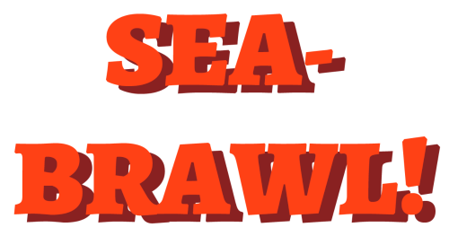  
Das verwendete Spiel trägt den Namen "Sea Brawl" und stammt aus einem älteren Projekt aus dem Bachelorstudium. Auf einem abgegrenzten Terrain bekämpfen sich zwei oder mehr Schiffe. Ziel ist es, mittels Kanonenschüssen die Gegner zu treffen, und selbst den Kanonenkugeln gegnerischer Schiffe auszuweichen. Da das Spiel einen Wettkampf zwischen mehreren Spielern darstellt, eignet es sich sehr gut für einen Machine Learning Ansatz. Des Weiteren ist es bereits in Unity implementiert, wodurch die Annahme bestand, dass sich die Anpassungen in Grenzen hielten. (siehe [Anpassungen von Sea Brawl](anpassung-von-sea-brawl))

# Projektziele
Ziel des Projekts ist es, mit Hilfe von Unity ML-Agents das Spiel *Sea Brawl*, um einen KI-Modus zu erweitern. Dazu sollen die Möglichkeiten von Unity ML-Agents kennengelernt und die künstliche Intelligenz durch maschinelles Lernen erzeugt werden. Es gilt korrekte Belohnungsfunktionen für das vorhandene Spiel zu definieren, damit die Agenten nach dem Spielprinzip sinnvolle Aktionen ausführen. Dazu sollen die Ansätze von Reinforcement Learning und Imitation Learning verinnerlicht und angewandt werden. Es gilt herauszufinden, welcher der Machine Learning Ansätze für das gegebene Spiel am besten geeignet ist.

## Minimal Viable Product
Das Team hat sich im Vorfeld auf ein Minimal Viable Product (kurz MVP) verständigt, welches für einen erfolgreichen Projektabschluss auf jeden Fall erfüllt sein sollte. Dieses sieht wie folgt aus:

* Zwei computergesteuerte Agenten spielen das Spiel selbstständig.
* Agenten spielen das Spiel nach dem Spielprinzip und führen sinnvolle Aktionen aus.
* Die Agenten sind nicht übermäßig stark, sodass ein menschlicher Spieler eine Chance hätte.
* Die Agents sind nicht zu schwach, sodass ein menschlicher Gegenspieler nicht unterfordert wird.

## Zusammenfassung der Aufgaben
* Sea Brawl an Unity ML-Agents anpassen / Neu schreiben
* Lernumgebung aufsetzen
  * Observation Space
  * Action Space
* Belohnungsfunktion definieren
* Hyperparameter definieren

# Projektverlauf

## Entwicklungsumgebung
Die Entwicklungsumgebung besteht aus folgenden Komponenten:

* Windows, Mac OSX oder Linux
* Unity 2017.1 oder neuer
* Python 3
  * [TensorFlow](https://www.tensorflow.org/)
  * [Jupyter](http://jupyter.org/)

### Installation
Unitys ML-Agents Framework ist einfach einzurichten. Grundvorraussetzung ist das Erfüllen aller Abhängigkeiten aus der definierten [Entwicklungsumgebung](#environment).  
Auf Grund der Abgrenzung verschiedener Projekte wird der Einsatz der Python-Umgebungen empfohlen. Für das zu betrachtende Projekt wurde eine Anaconda Umgebung auf Basis von Python 3.6 verwendet.  
Die benötigten Python-Pakete sind in der `requirements.txt` im Unterverzeichnis `python/` des Repositories hinterlegt. Mittels `pip3 install .` können diese einfach installiert werden. Je nach Betriebssystem/Umgebungslösung kann sich der Name von `pip3` unterscheiden (z.B. nur `pip`). Hinzukommend wurde das Paket tensorflow-gpu 1.8.0. verwendet, um auf der Grafikkarte (GeForce 950 GTX) lernen zu können.

## Anpassung von Sea Brawl
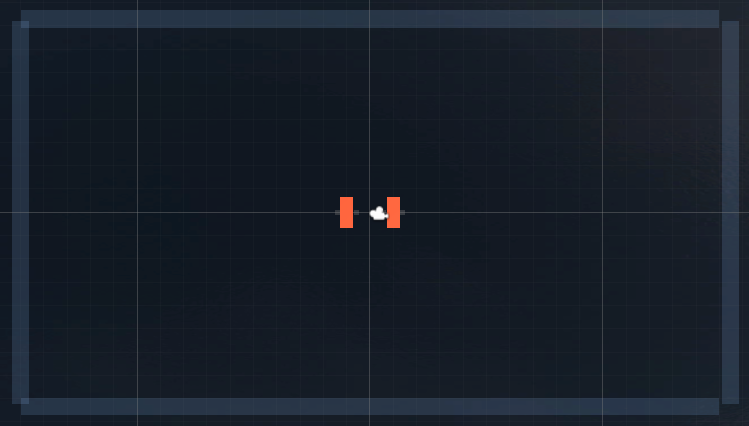  
Nach eingehender Sichtung der Implementierung des Spiels Sea Brawl wurde schnell klar, dass eine Anpassung des Spieles zu aufwendig wäre. Infolgedessen wurde das Grundprinzip des Spiels neu implementiert. Das Spiel besteht aus zwei Schiffen, die jeweils an der rechten und linken Seite einen Kanonenbug besitzen. Aus diesen können unabhängig von einander Kanonen abgefeuert werden. Die Schiffe befahren einen abgegrenzten Bereich, der Wasser darstellen soll. Bei der neu-Implementierung wurde von vornhinein darauf geachtet, dass das Spiel zu Unity ML-Agents kompatibel ist. Auf aufwendige grafische Effekte wurde zu gunsten der Rechen-/Lernzeit verzichtet.

### Near-Area der Schiffe
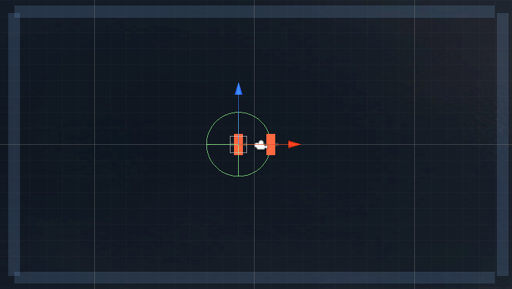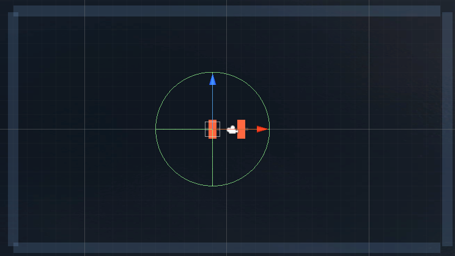  
Die Schiffe wurden zusätzlich zu den zuvor genannten Funktionen um jeweils zwei Near-Areas-Collider erweitert. Dies sind definierte Bereiche, die sich kreisförmig um die Schiffe bilden. Jedes Schiff hat je einen kleinen und einen weitläufigeren Bereich um seinen Körper. Diese Bereiche sind im späteren Verlauf für die Berechnung von Belohnungen von Nöten. So kann berechnet werden, ob ein Kanonenschuss eines Spielers in die Nähe des gegenerischen Schiffs gelangt. Die zwei Bereiche wurden definiert, um eine Abstufung der Belohnung zu erreichen (in der Nähe und sehr nah). Für den Betrachter sind die Near-Areas nicht sichtbar.

## Learning Environment
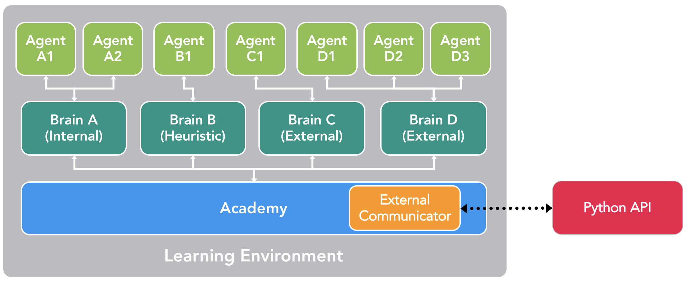  
In Unity ist eine Learning Environment (dt. Lernumgebung) die Grundvorraussetzung, um mit ML-Agents arbeiten zu können. Grundlegend wird eine Learning Environment als eine Applikation beschrieben, die auf der Unity Engine fußt. Demzufolge ist SeaBrawl ebenfalls eine Learning Environment. Weitere Bestandteile sind die Academy, Brains und Agents. Diese werden im Folgenden näher erläutert.

### Agents
Ein Agent beobachtet seine Umwelt und kann auf Grundlage dieser Beobachtungen den besten Weg zu einer Lösung finden. Ein Agent muss mit einem Brain verbunden sein und gibt seine Beobachtungen an dieses weiter. Er erhält von diesem eine Entscheidung zurück. In ML-Agents existieren drei Möglichkeiten der Beobachtung:

* Kontinuierlicher Vektor - ein Feature Vektor, der aus einem Array von Zahlen besteht
* Diskreter Vektor - ein Index in einer Zustandstabelle (nur für sehr einfache Umgebungen)
* Visuelle Beobachtungen - ein oder mehrere Kamerabilder

### Brains
Ein Brain ist für den Entscheidungsprozess zuständig. Das Brain entscheidet anhand der Beobachtungen eines Agents und gibt diese Entscheidung an ihn zurück. Ein Brain kann von einem oder mehreren Agents verwendet werden. In ML-Agents existieren vier Typen von Brains:

* External - Zum trainieren von Agents (zum Beispiel via Python)
* Internal - Verwenden eines trainierten Models
* Heuristic - Hartkodierte Logik (klassischer Ansatz, kein Machine Learning)
* Player - Menschlicher Spieler (zum Beispiel, um den Agent zu testen, oder als Grundlage für das Imitation Learning)

### Academy
Eine Academy orchestriert alle Agents und Brains einer Unity-Szene. Jede Szene, die Agents enthält, muss zwingend eine Academy besitzen. Eine Academy wird für folgende Funktionen verwendet:

* Initialisieren der Umgebung nachdem die Szene geladen wurde
* Zurücksetzen der Umgebung
* Verändern von Dingen in der Umgebung nach jeden Simulationsschritt (Reset-Function)

## Observation Space
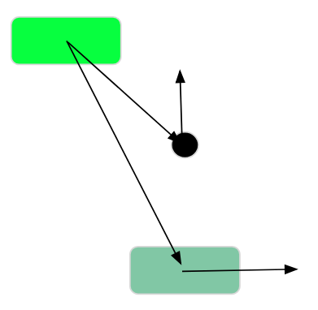  
Für den Observation Space (die Dinge, die ein Agent beobachten kann) wurden folgende Attribute gewählt:

| Typ       | Beschreibung                         |
|-----------|--------------------------------------|
| `Vector2` | Richtung zum Schiff                  |
| `Float`   | Entfernung zum Schiff                |
| `Vector2` | Bewegungsrichtung des Schiffs        |
| `Vector2` | Richtung der Nächsten Kanonenkugel   |
| `Float`   | Entfernung der nächsten Kanonenkugel |
| `Vector2` | Bewegungsrichtung der Kanonenkugel   |

## Action Space
Der Action Space definiert die Aktionen, die ein Brain einem Agent als Entscheidung zurück geben kann. Folgende Actions wurden definiert:
* Horizontales Fahren `(W, S)`
* Vertikales Fahren `(A, D)`
* Schießen einer Kanonenkugel aus dem linken oder rechten Schiffsbug `(C, V)`

## Belohnungsfunktionen
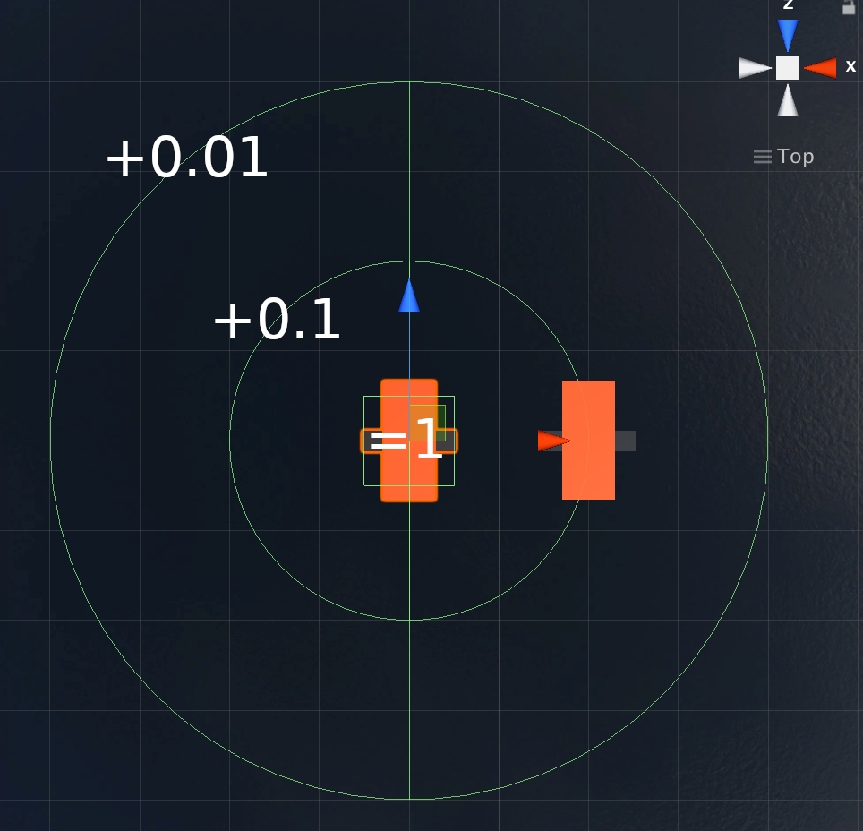
Anhand einer Belohnungsfunktion kann ein Brain bewerten wie gut die an den Agent gegebene Entscheidung war. Es wurden drei Belohnungsfunktionen definiert:

| Aktion                                                            | Belohnungswert |
|-------------------------------------------------------------------|---------------:|
| Treffen des Gegners                                               |           =1.0 |
| Abgeschossene Kanonenkugel verfehlt Ziel knapp (äußere Near-Area) |          +0.01 |
| Abgeschossene Kanonenkugel verfehlt Ziel knapp (innere Near-Area) |           +0.1 |
| Schiff fährt gegen eine Wand                                      |          -0.01 |

## Ergebnisse

### Wie es aussehen sollte
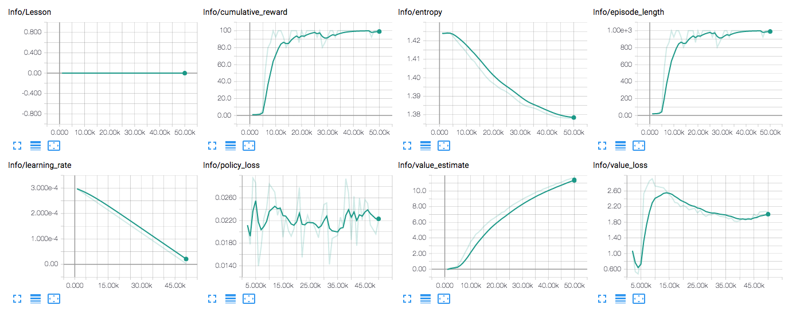  
Die Grafik zeigt ein beispielhaften Verlauf an dem ein gutes Trainingsszenario gemessen werden kann. Der erste Graph Lesson zeigt beim curriculum training den Fortschritt an, welcher für unser Training nicht genutzt wurde. Der Graph des Cumulative Reward ist die durchschnittliche Belohnung über alle Agents in einer Epoche. Da in unserem Szenario der Erfolg des einen Agents den Misserfolg des Gegenspieler (adversarial selfplay) bedeutet, wird dieser Graph bei uns allerdings immer nur den halben Reward des Gewinner anzeigen. Die Episodenlänge sollte bei uns mit der Zeit, anders als in diesem Beispiel hier abnehmen da die beiden Agents wissen sollten was sie tun und nicht beide in irgend einer Ecke fest hängen sollten. Value Loss beschreibt wie genau ein Agent in der Lage ist sein Erfolg vorherzusagen. 

### Extern vs extern mit einem gemeinsamen Brain
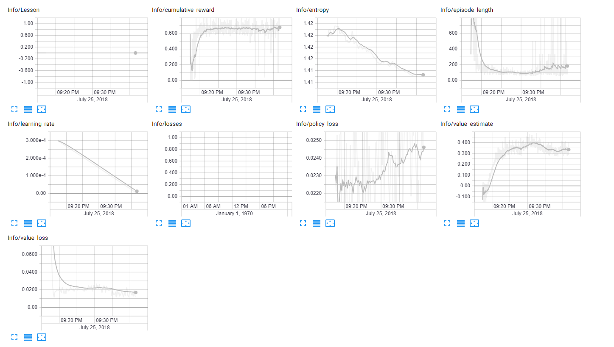  
Hier ist gut zu sehen wie mit vorranschreitendem Training die Graphen von `cumulative_reward` und `episode_length` Stabilisieren. Der Wert der Entropy, welcher die Zufälligkeit der Entscheidungen misst, nimmt auch ab. Beides deutet darauf hin, dass die beiden Agents einen Weg gefunden haben, Kurze und effiziente Spiele zu spielen. Auch wenn das Ergebnis dabei war, dass beide Agents gleich nach Start an den nördlichen Spielfeldrand fahren und solange schießen bis der andere oder man selbst tot ist.

### Extern vs extern mit einem gemeinsamen Brain (Nachttraining)
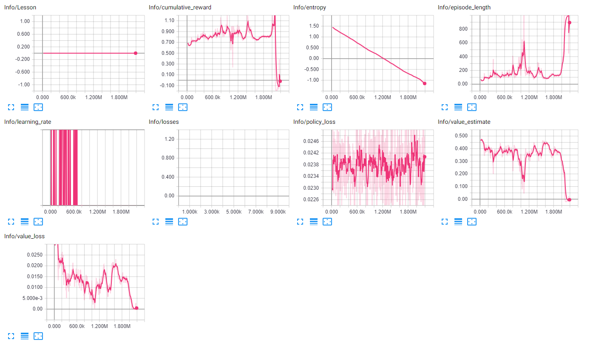  
Dies war eine Trainingssession von etwa sechs Stunden. Leider war es uns nicht mehr möglich den wahrscheinlich interessantesten Stand des Lernprozesses zu laden. Die Standarteinstellung welche wir nicht geändert haben speichert nur die letzten fünf Checkpoints. Hätten wir diese geändert könnten wir das Verhalten analysieren was zu dem Höhepunkt im Graphen der `cumulative_reward` geführt hat. Warum hier der Graph der `learning_rate` so Fehlerhaft aussieht konnte bis zum jetzigen Zeitpunkt nicht geklärt werden.

### Extern vs extern mit je einem Brain
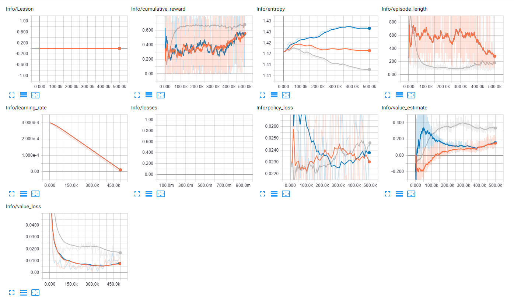  
Besonders Interessant bei diesem Durchlauf ist der Unterschied zwischen dem Lernen auf einem oder zwei unterschiedlichen Brains. Der orangefarbene und der blaue Graph wurden dabei gegeneinander Trainiert. Im Verhältnis zu der grauen Linie (beide Agents lernen auf ein Brain) dauern die Runden wesentlich länger, verlaufen mit weniger Belohnungen und die Entscheidungen sind zufälliger.

### Sonderfälle
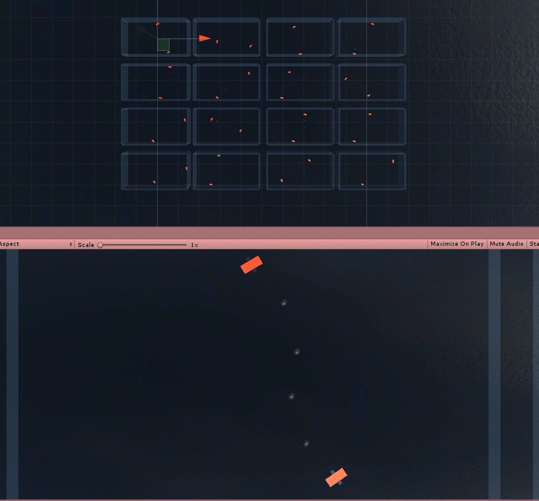  
An dem oben abgebildeten Sonderfall kann sehr gut erkannt werden, dass die Belohnungsfunktion noch nicht perfekt ist. In diesem Trainingslauf hat das Brain als beste Möglichkeit, um besonders viele Belohnungspunkte zu sammeln entschieden, dass das Fahren im Kreis mit einem bestimmten Abstand zum Gegner bei gleichzeitigem Dauerfeuer die höchste Belohnung einbringt. Die Belohnung erhält das Brain, da jeder abgefeuerte Schuss in die Near-Area des Gegners fliegt. Für diesen Sonderfall wurde die zusätzliche Regel eingeführt, dass eine Runde nach 1000 Schritten der Schiffe unentschieden endet und die Reset-Funktion aufgerufen wird.

### Ergebnisse gegen eine Heuristik
Um die Effizienz der angelernten Agents zu validieren, wurde ein heuristisches Brain implementiert. Dieses stellt einen fast perfekten Spieler dar und soll sehr schwer zu Besiegen sein. Eine Heuristik bietet sich gut für die Validierung an, da sie immer konstante Ergebnisse liefert.

#### Funktionen der Heuristik
Die implementierte Heuristik bietet insgesamt drei verschiedene Fähigkeiten:
1. Ausweichen
2. Schießen
3. Verfolgen

#### Ergebnisse gegen die Heuristik
Die angelernten Agents wurden mit verschiedenen Brains gegen das heuristische Brain in den Kampf geschickt. Die Ergebnisse sind in folgender Tabelle abgebildet:

| Gegner                                       | Ergebnis (win-loss-draw) |
|----------------------------------------------|--------------------------|
| External vs External 1 Brain (20 Min)        | 38-151-11                |
| External vs External 2 Brain (20 Min) Brain1 | 41-149-10                |
| External vs External 2 Brain (20 Min) Brain2 | 26-153-21                |
| Spieler                                      | 33-153-14                |
| IL Internal (20 Min)                         | 34-157-9                 |
| External 1 Night Learn x16 (6 hours)         | 60-140-0                 |

Es ist Anhand der Ergebnisse klar erkennbar, dass die angelernten Agents gegen einen Agent mit heuristischem Brain kaum eine Chance haben. Aber auch ein menschlicher Spieler ist gegen die Heuristik chancenlos.

#### Interaktion mit der Community & Bug Hunting
Das Unity-ML Repository wird aktiv gepflegt und bietet die Möglichkeit der Interaktion mit der Community, welche wir auch Genutzt haben. So haben wir Beispielsweise ein [Issue](https://github.com/Unity-Technologies/ml-agents/issues/1008) verfasst und versucht bei der Beantwortung anderer [Issues](https://github.com/Unity-Technologies/ml-agents/issues/980) zu helfen.

# Ausblick
Für die Zukunft sollen auf jeden Fall die Lernsessions der Agents deutlich verlängert werden. Da dieses Projekt einen sehr begrenzten Zeitrahmen bot und die verfügbare Hardware nicht unbedingt für Machine Learning optimiert wurde, könnten bei entsprechender Hardware und längeren Lernsessions bessere Ergebnisse erzielt werden. An Beispielen wie dem angesprochenen Sonderfall ist klarer Optimierungsbedarf in der Belohnungsfunktion erkennbar.

* Imitation Learning gegen die Heuristic
* External Learning  gegen die Heuristic
* Längere Learn-Sessions
* Hyperparameter

# Fazit
Das Projekt wurde erfolgreich beendet und das Minimal Viable Product erfüllt. Das Projekt bot einen tiefen Einblick in die Mechanismen des Machine Learnings und Unitys Verständnis von diesem. Obwohl erst ziemlich zum Ende eine Heuristik erstellt wurde, konnte diese dennoch dazu verwendet werden, um Observation-, Action-Space und die Belohnungsfunktion zu evaluieren. Es bleibt spannend zu Beobachten, wie sich ML-Agents in Zukunft weiterentwickelt. Bisher steht das Framework noch im Beta-Status 'preview'.
